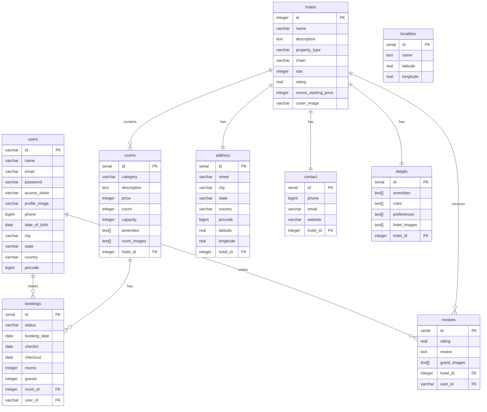

# 🏨 Booking App

A full-stack hotel booking application built with **Flutter** (Frontend) and **Dart Frog** (Backend) with **PostgreSQL** database. This application allows users to search for hotels, view details, make bookings, and leave reviews.

[](https://flutter.dev)
[](https://dart.dev)
[](https://dart-frog.dev)
[](https://www.postgresql.org)

---

## 📑 Table of Contents

- [Features](#-features)
- [Architecture](#-architecture)
- [Database Schema](#-database-schema-er-diagram)
- [Prerequisites](#-prerequisites)
- [Installation & Setup](#-installation--setup)
  - [Backend Setup](#1-backend-setup)
  - [Frontend Setup](#2-frontend-setup)
- [Running the Application](#-running-the-application)
- [API Documentation](#-api-documentation)
- [Project Structure](#-project-structure)
- [Technologies Used](#-technologies-used)
- [Troubleshooting](#-troubleshooting)

---

## ✨ Features

### User Features

- 🔍 **Hotel Search** - Search hotels by location with radius-based filtering
- 🏨 **Hotel Listings** - Browse hotels with detailed information
- 🛏️ **Room Categories** - View different room types and availability
- 📅 **Booking System** - Book rooms with check-in/check-out dates
- ⭐ **Reviews & Ratings** - Read and write hotel reviews
- 🎯 **Advanced Filters** - Filter by star rating, property type, price, and more
- 📱 **Multi-Platform** - Runs on iOS, Android, Web, and Windows

### Admin Features

- 🏗️ **Hotel Management** - Add, update, and delete hotels
- 📊 **Data Seeding** - Generate fake data for testing (1000+ hotels)
- 🔑 **API Secret Key** - Admin operations protected by secret key

---

## 🏗️ Architecture

This application follows a **3-tier architecture**:

```
┌───────────────────────────────────────────────────────────────┐
│                        PRESENTATION LAYER                     │
│  ┌─────────────────────────────────────────────────────────┐  │
│  │              Flutter Frontend (BLoC Pattern)            │  │
│  │  ┌────────────┐  ┌────────────┐  ┌──────────────────┐   │  │
│  │  │  Auth Page │  │ Hotel List │  │  Hotel Details   │   │  │
│  │  └────────────┘  └────────────┘  └──────────────────┘   │  │
│  │  ┌────────────┐  ┌────────────┐  ┌──────────────────┐   │  │
│  │  │  Auth Bloc │  │ Hotel Bloc │  │ Repositories     │   │  │
│  │  └────────────┘  └────────────┘  └──────────────────┘   │  │
│  └─────────────────────────────────────────────────────────┘  │
└───────────────────────────────────────────────────────────────┘
                              ▼ HTTP/REST API
┌────────────────────────────────────────────────────────────────┐
│                       APPLICATION LAYER                        │
│  ┌──────────────────────────────────────────────────────────┐  │
│  │           Dart Frog Backend (RESTful API)                │  │
│  │  ┌────────────────────────────────────────────────────┐  │  │
│  │  │              API Routes (v1)                       │  │  │
│  │  │  /auth/signup  /auth/signin  /hotels  /search      │  │  │
│  │  │  /hotels/:id/room  /hotels/:id/review              │  │  │
│  │  │  /hotels/:id/room/:id/booking                      │  │  │
│  │  └────────────────────────────────────────────────────┘  │  │
│  │  ┌────────────────────────────────────────────────────┐  │  │
│  │  │              Middleware Layer                      │  │  │
│  │  │  Auth  │  DB Connection  │  Services  │  Logging   │  │  │
│  │  └────────────────────────────────────────────────────┘  │  │
│  │  ┌────────────────────────────────────────────────────┐  │  │
│  │  │              Controllers & Services                │  │  │
│  │  │  AuthController  HotelController  BookingService   │  │  │
│  │  └────────────────────────────────────────────────────┘  │  │
│  └──────────────────────────────────────────────────────────┘  │
└────────────────────────────────────────────────────────────────┘
                              ▼ SQL Queries
┌────────────────────────────────────────────────────────────────┐
│                          DATA LAYER                            │
│  ┌──────────────────────────────────────────────────────────┐  │
│  │              PostgreSQL Database                         │  │
│  │  ┌──────┐  ┌───────┐  ┌──────┐  ┌─────────┐  ┌───────┐   │  │
│  │  │Users │  │Hotels │  │Rooms │  │Bookings │  │Reviews│   │  │
│  │  └──────┘  └───────┘  └──────┘  └─────────┘  └───────┘   │  │
│  │  ┌────────┐  ┌────────┐  ┌────────┐  ┌────────────┐      │  │
│  │  │Address │  │Contact │  │Details │  │Localities  │      │  │
│  │  └────────┘  └────────┘  └────────┘  └────────────┘      │  │
│  │                                                          │  │
│  │  Triggers: Auto-update hotel ratings                     │  │
│  │  Functions: Distance calculation (geolocation)           │  │
│  └──────────────────────────────────────────────────────────┘  │
└────────────────────────────────────────────────────────────────┘
```

### Frontend Architecture (Flutter BLoC)

```
lib/
├── app/
│   ├── auth/          # Authentication feature
│   │   ├── bloc/      # BLoC (Business Logic Component)
│   │   └── view/      # UI components
│   └── hotel/         # Hotel feature
│       ├── bloc/      # BLoC for hotel management
│       └── view/      # UI components
├── data/
│   ├── client/        # HTTP client (Dio)
│   ├── model/         # Data models
│   └── repository/    # Data repositories
├── config/            # App configuration
└── l10n/              # Internationalization
```

### Backend Architecture (Dart Frog)

```
booking_backend/
├── routes/
│   ├── api/v1/
│   │   ├── auth/           # Authentication endpoints
│   │   ├── hotels/         # Hotel CRUD operations
│   │   ├── search/         # Search functionality
│   │   └── filter/         # Filter functionality
│   └── index.dart          # Root endpoint
├── lib/
│   ├── controller/         # Request handlers
│   ├── service/            # Business logic
│   ├── middleware/         # Auth, logging, etc.
│   ├── models/             # Data models
│   └── database/           # DB connection & setup
```

---

## 🗄️ Database Schema (ER Diagram)



### Key Relationships

- **Users** can make multiple **Bookings** and write multiple **Reviews**
- **Hotels** have one **Address**, one **Contact**, and one **Details** record
- **Hotels** contain multiple **Rooms** and receive multiple **Reviews**
- **Rooms** can have multiple **Bookings**
- **Localities** are used for geolocation-based search

### Database Functions & Triggers

- **`distance()`** - Calculates distance between two coordinates (geolocation search)
- **`update_hotel_rating()`** - Automatically updates hotel rating when a review is added

---

## 📋 Prerequisites

Before you begin, ensure you have the following installed:

- **Flutter SDK**: >= 3.35.0
- **Dart SDK**: >= 3.9.0 (comes with Flutter)
- **PostgreSQL**: >= 15.x
- **Docker & Docker Compose**: (Optional, for containerized setup)
- **Dart Frog CLI**: Install with `dart pub global activate dart_frog_cli`
- **Very Good CLI**: (Optional) Install with `dart pub global activate very_good_cli`

### System Requirements

- **OS**: macOS, Linux, or Windows
- **RAM**: Minimum 8GB recommended
- **Storage**: 5GB free space

---

## 🚀 Installation & Setup

### 1. Backend Setup

#### Step 1.1: Clone the Repository

```bash
git clone https://github.com/G1Joshi/Booking-App.git
cd Booking-App
```

#### Step 1.2: Setup PostgreSQL Database

**Option A: Using Docker (Recommended)**

```bash
cd booking_backend
docker-compose up -d
```

This will start:

- PostgreSQL database on `localhost:5432`
  - Database: `booking`
  - Username: `booking`
  - Password: `booking`
- Adminer (DB admin tool) on `localhost:8080`

**Option B: Manual PostgreSQL Setup**

```bash
# Install PostgreSQL (macOS)
brew install postgresql@15
brew services start postgresql@15

# Create database and user
psql postgres
CREATE DATABASE booking;
CREATE USER booking WITH ENCRYPTED PASSWORD 'booking';
GRANT ALL PRIVILEGES ON DATABASE booking TO booking;
\q
```

#### Step 1.3: Initialize Database Schema

```bash
cd booking_backend

# Connect to database
psql -h localhost -U booking -d booking

# Run SQL scripts in order
\i lib/database/tables.sql
\i lib/database/functions.sql
\i lib/database/triggers.sql
\q
```

#### Step 1.4: Install Backend Dependencies

```bash
cd booking_backend
dart pub get
```

---

### 2. Frontend Setup

#### Step 2.1: Navigate to Frontend Directory

```bash
cd booking_frontend
```

#### Step 2.2: Install Dependencies

```bash
flutter pub get
```

---

## 🎮 Running the Application

### Start Backend Server

#### Development Mode (Hot Reload)

```bash
cd booking_backend
dart_frog dev --port 8090
```

Server will start at: `http://localhost:8090`

You should see:

```
✓ Running on http://localhost:8090 (99ms)
The Dart VM service is listening on http://127.0.0.1:8181/XXXXXXXX/
```

#### Production Mode

```bash
cd booking_backend
dart_frog build
dart run build/bin/server.dart
```

#### Using Docker

```bash
cd booking_backend/build
docker build -t booking-backend .
docker run -p 8090:8090 booking-backend
```

---

### Start Frontend Application

#### Development Flavor

```bash
cd booking_frontend
flutter run --flavor development --target lib/main_development.dart
```

#### Staging Flavor

```bash
flutter run --flavor staging --target lib/main_staging.dart
```

#### Production Flavor

```bash
flutter run --flavor production --target lib/main_production.dart
```

#### Run on Specific Platform

```bash
# iOS
flutter run -d ios --flavor development --target lib/main_development.dart

# Android
flutter run -d android --flavor development --target lib/main_development.dart

# Web
flutter run -d chrome --flavor development --target lib/main_development.dart

# Windows
flutter run -d windows --flavor development --target lib/main_development.dart
```

---

## 📡 API Documentation

### Base URL

```
http://localhost:8080/api/v1
```

### Authentication

#### Sign Up

```http
POST /auth/signup
Content-Type: application/json

{
  "id": "123456789",
  "name": "John Doe",
  "email": "john@example.com",
  "phone": 1234567890,
  "date_of_birth": "1990-01-01",
  "city": "New York",
  "state": "NY",
  "country": "USA",
  "pincode": 10001
}
```

#### Sign In

```http
POST /auth/signin
Content-Type: application/json

{
  "email": "jeevan@example.com",
  "password": "your_password"
}
```

### Hotels

#### Get All Hotels

```http
GET /hotels
Authorization: Bearer ACCESS_TOKEN
```

#### Get Hotel Details

```http
GET /hotels/{hotel_id}
Authorization: Bearer ACCESS_TOKEN
```

#### Add Hotel (Admin)

```http
POST /hotels
X-Secret-Key: YOUR_SECRET_KEY
Content-Type: application/json

{
  "name": "Grand Hotel",
  "description": "Luxury hotel",
  "property_type": "Hotel",
  "chain": "Tata",
  "star": 5,
  "rating": 4.5,
  "rooms_starting_price": 5000,
  "cover_image": "https://example.com/image.jpg"
}
```

### Search & Filter

#### Search Hotels

```http
GET /search?locality=Mumbai&distance=10&checkin=2024-01-01&checkout=2024-01-05&rooms=2
Authorization: Bearer ACCESS_TOKEN
```

#### Filter Hotels

```http
GET /filter?star=4,5&rating=4.0&propertyType=Hotel&budget=10000
Authorization: Bearer ACCESS_TOKEN
```

### Rooms

#### Get Rooms

```http
GET /hotels/{hotel_id}/room
Authorization: Bearer ACCESS_TOKEN
```

#### Get Room Details

```http
GET /hotels/{hotel_id}/room/{room_id}
Authorization: Bearer ACCESS_TOKEN
```

### Bookings

#### Create Booking

```http
POST /hotels/{hotel_id}/room/{room_id}/booking
Authorization: Bearer ACCESS_TOKEN
Content-Type: application/json

{
  "booking_date": "2024-01-01",
  "checkin": "2024-01-15",
  "checkout": "2024-01-20",
  "rooms": 2,
  "adults": 4
}
```

#### Get Booking

```http
GET /hotels/{hotel_id}/room/{room_id}/booking/{booking_id}
Authorization: Bearer ACCESS_TOKEN
```

### Reviews

#### Add Review

```http
POST /hotels/{hotel_id}/review
Authorization: Bearer ACCESS_TOKEN
Content-Type: application/json

{
  "rating": 4.5,
  "review": "Great hotel!",
  "guest_images": ["url1", "url2"]
}
```

#### Get Reviews

```http
GET /hotels/{hotel_id}/review
Authorization: Bearer ACCESS_TOKEN
```

---

## 📁 Project Structure

### Backend Structure

```
booking_backend/
├── docker-compose.yaml         # Docker configuration
├── pubspec.yaml               # Dependencies
├── routes/                    # API routes
│   ├── index.dart            # Root endpoint
│   └── api/v1/               # API version 1
│       ├── _middleware.dart  # Route middleware
│       ├── auth/             # Authentication routes
│       ├── hotels/           # Hotel routes
│       ├── search/           # Search endpoint
│       └── filter/           # Filter endpoint
├── lib/
│   ├── config/
│   │   └── constants.dart    # App constants
│   ├── controller/           # Request controllers
│   │   ├── auth_controller.dart
│   │   ├── hotel_controller.dart
│   │   ├── booking_controller.dart
│   │   └── review_controller.dart
│   ├── service/              # Business logic services
│   │   ├── auth_service.dart
│   │   ├── hotels_service.dart
│   │   ├── room_service.dart
│   │   ├── booking_service.dart
│   │   └── review_service.dart
│   ├── middleware/           # Middleware functions
│   │   ├── auth_service_middleware.dart
│   │   ├── db_connection_middleware.dart
│   │   └── token_verification_middleware.dart
│   ├── models/               # Data models
│   │   ├── user_model.dart
│   │   ├── hotel_model.dart
│   │   ├── booking_model.dart
│   │   └── review_model.dart
│   ├── database/             # Database setup
│   │   ├── connection.dart   # DB connection
│   │   └── tables.dart       # Table name constants
│   └── sql/                  # SQL scripts
│       ├── tables.sql        # Table schemas
│       ├── functions.sql     # SQL functions
│       ├── triggers.sql      # SQL triggers
│       ├── seed.sql          # Sample data
│       └── drop.sql          # Drop tables script
└── test/                     # Tests
```

### Frontend Structure

```
booking_frontend/
├── pubspec.yaml             # Dependencies
├── lib/
│   ├── main_development.dart   # Development entry
│   ├── main_staging.dart       # Staging entry
│   ├── main_production.dart    # Production entry
│   ├── bootstrap.dart          # App initialization
│   ├── app/
│   │   ├── view/
│   │   │   └── app.dart        # Main app widget
│   │   ├── auth/               # Authentication feature
│   │   │   ├── bloc/
│   │   │   │   ├── auth_bloc.dart
│   │   │   │   ├── auth_event.dart
│   │   │   │   └── auth_state.dart
│   │   │   └── view/
│   │   │       ├── auth_page.dart
│   │   │       └── components.dart
│   │   ├── hotel/              # Hotel feature
│   │   │   ├── bloc/
│   │   │   │   ├── hotel_bloc.dart
│   │   │   │   ├── hotel_event.dart
│   │   │   │   └── hotel_state.dart
│   │   │   └── view/
│   │   │       ├── hotel_page.dart
│   │   │       ├── hotel_details_page.dart
│   │   │       └── components.dart
│   │   └── widgets/            # Shared widgets
│   ├── config/
│   │   ├── apis.dart           # API endpoints
│   │   └── storage.dart        # Local storage
│   ├── data/
│   │   ├── client/             # HTTP client
│   │   ├── model/              # Data models
│   │   │   ├── user_model.dart
│   │   │   ├── hotel_model.dart
│   │   │   ├── filter_model.dart
│   │   │   └── token_model.dart
│   │   └── repository/         # Data repositories
│   │       ├── auth_repository.dart
│   │       └── hotel_repository.dart
│   ├── l10n/                   # Internationalization
│   │   └── arb/
│   │       └── app_en.arb
│   └── utils/                  # Utilities
├── android/                    # Android platform
├── ios/                        # iOS platform
├── web/                        # Web platform
├── windows/                    # Windows platform
└── test/                       # Tests
```

---

## 🛠️ Technologies Used

### Frontend

| Technology                                                        | Purpose                        |
| ----------------------------------------------------------------- | ------------------------------ |
| [Flutter](https://flutter.dev)                                    | Cross-platform UI framework    |
| [Dart](https://dart.dev)                                          | Programming language           |
| [flutter_bloc](https://pub.dev/packages/flutter_bloc)             | State management (BLoC)        |
| [Dio](https://pub.dev/packages/dio)                               | HTTP client for API calls      |
| [shared_preferences](https://pub.dev/packages/shared_preferences) | Local storage for tokens       |
| [flutter_rating_bar](https://pub.dev/packages/flutter_rating_bar) | Rating UI component            |
| [shimmer](https://pub.dev/packages/shimmer)                       | Loading shimmer animations     |
| [equatable](https://pub.dev/packages/equatable)                   | Value equality for BLoC        |
| [intl](https://pub.dev/packages/intl)                             | Internationalization & formats |

### Backend

| Technology                                    | Purpose                             |
| --------------------------------------------- | ----------------------------------- |
| [Dart Frog](https://dart-frog.dev)            | Backend REST API framework          |
| [Dart](https://dart.dev)                      | Programming language                |
| [PostgreSQL](https://www.postgresql.org)      | Relational database                 |
| [postgres](https://pub.dev/packages/postgres) | PostgreSQL driver for Dart          |
| [uuid](https://pub.dev/packages/uuid)         | UUID v4 for access token generation |

### DevOps

| Technology                                         | Purpose                       |
| -------------------------------------------------- | ----------------------------- |
| [Docker](https://www.docker.com)                   | Containerization              |
| [Docker Compose](https://docs.docker.com/compose/) | Multi-container orchestration |
| [Adminer](https://www.adminer.org)                 | Database management tool      |

---

## 🧪 Testing

### Backend Tests

```bash
cd booking_backend
dart test
```

### Frontend Tests

```bash
cd booking_frontend

# Unit & Widget tests
flutter test

# Coverage report
very_good test --coverage --test-randomize-ordering-seed random

# View coverage
genhtml coverage/lcov.info -o coverage/
open coverage/index.html
```

---

## 🐛 Troubleshooting

### Backend Issues

**Issue: Database connection failed**

```
Solution:
1. Check if PostgreSQL is running: pg_isready
3. Ensure database exists: psql -l
```

### Frontend Issues

**Issue: Cannot connect to backend**

```
Solution:
1. Verify backend is running on localhost:8080
2. Check API_URL in lib/config/apis.dart
3. For physical devices, use network IP instead of localhost
```

---

## 👨‍💻 Author

**Jeevan Joshi** ([@G1Joshi](https://github.com/G1Joshi))

---

## 🙏 Acknowledgments

- [Very Good Ventures](https://verygood.ventures) for Flutter best practices
- [Dart Frog Team](https://dart-frog.dev) for the amazing backend framework
- [Flutter Community](https://flutter.dev/community) for continuous support

---

**Happy Coding! 🚀**
