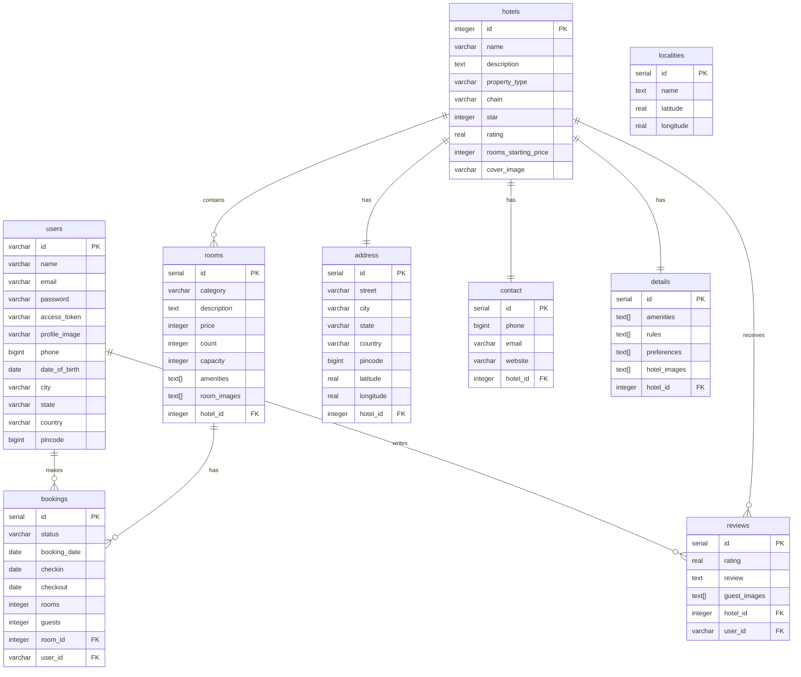

# 🏨 Booking App

[](https://github.com/G1Joshi/Booking-App/actions/workflows/main.yml)
[](https://melos.invertase.dev/)

A full-stack hotel booking application built with **Flutter** (Frontend) and **Dart Frog** (Backend) with **PostgreSQL** database. This application allows users to search for hotels, view details, make bookings, and leave reviews.

[](https://flutter.dev)
[](https://dart.dev)
[](https://docs.docker.com/)
[](https://www.postgresql.org)

---

## 📑 Table of Contents

- [Features](#-features)
- [Architecture](#-architecture)
- [Database Schema](#-database-schema-er-diagram)
- [Prerequisites](#-prerequisites)
- [Installation & Setup](#-installation--setup)
  - [Initialize Workspace](#1-initialize-workspace)
  - [Backend Setup](#2-backend-setup)
- [Running the Application](#-running-the-application)
- [Technologies Used](#-technologies-used)
- [Troubleshooting](#-troubleshooting)

---

## ✨ Features

### User Features

- 🔍 **Hotel Search** - Search hotels by location with radius-based filtering
- 🏨 **Hotel Listings** - Browse hotels with detailed information
- 🛏️ **Room Categories** - View different room types and availability
- 📅 **Booking System** - Book rooms with check-in/check-out dates
- ⭐ **Reviews & Ratings** - Read and write hotel reviews
- 🎯 **Advanced Filters** - Filter by star rating, property type, price, and more
- 📱 **Multi-Platform** - Runs on iOS, Android, Web, and Windows

### Admin Features

- 🏗️ **Hotel Management** - Add, update, and delete hotels
- 📊 **Data Seeding** - Generate fake data for testing (1000+ hotels)
- 🔑 **API Secret Key** - Admin operations protected by secret key

---

## 🏗️ Architecture

This application follows a **3-tier architecture**:

```
┌───────────────────────────────────────────────────────────────┐
│                        PRESENTATION LAYER                     │
│  ┌─────────────────────────────────────────────────────────┐  │
│  │              Flutter Frontend (BLoC Pattern)            │  │
│  │  ┌────────────┐  ┌────────────┐  ┌──────────────────┐   │  │
│  │  │  Auth Page │  │ Hotel List │  │  Hotel Details   │   │  │
│  │  └────────────┘  └────────────┘  └──────────────────┘   │  │
│  │  ┌────────────┐  ┌────────────┐  ┌──────────────────┐   │  │
│  │  │  Auth Bloc │  │ Hotel Bloc │  │ Repositories     │   │  │
│  │  └────────────┘  └────────────┘  └──────────────────┘   │  │
│  └─────────────────────────────────────────────────────────┘  │
└───────────────────────────────────────────────────────────────┘
                              ▼ HTTP/REST API
┌────────────────────────────────────────────────────────────────┐
│                       APPLICATION LAYER                        │
│  ┌──────────────────────────────────────────────────────────┐  │
│  │           Dart Frog Backend (RESTful API)                │  │
│  │  ┌────────────────────────────────────────────────────┐  │  │
│  │  │              API Routes (v1)                       │  │  │
│  │  │  /auth/signup  /auth/signin  /hotels  /search      │  │  │
│  │  │  /hotels/:id/room  /hotels/:id/review              │  │  │
│  │  │  /hotels/:id/room/:id/booking                      │  │  │
│  │  └────────────────────────────────────────────────────┘  │  │
│  │  ┌────────────────────────────────────────────────────┐  │  │
│  │  │              Middleware Layer                      │  │  │
│  │  │  Auth  │  DB Connection  │  Services  │  Logging   │  │  │
│  │  └────────────────────────────────────────────────────┘  │  │
│  │  ┌────────────────────────────────────────────────────┐  │  │
│  │  │              Controllers & Services                │  │  │
│  │  │  AuthController  HotelController  BookingService   │  │  │
│  │  └────────────────────────────────────────────────────┘  │  │
│  └──────────────────────────────────────────────────────────┘  │
└────────────────────────────────────────────────────────────────┘
                              ▼ SQL Queries
┌────────────────────────────────────────────────────────────────┐
│                          DATA LAYER                            │
│  ┌──────────────────────────────────────────────────────────┐  │
│  │              PostgreSQL Database                         │  │
│  │  ┌──────┐  ┌───────┐  ┌──────┐  ┌─────────┐  ┌───────┐   │  │
│  │  │Users │  │Hotels │  │Rooms │  │Bookings │  │Reviews│   │  │
│  │  └──────┘  └───────┘  └──────┘  └─────────┘  └───────┘   │  │
│  │  ┌────────┐  ┌────────┐  ┌────────┐  ┌────────────┐      │  │
│  │  │Address │  │Contact │  │Details │  │Localities  │      │  │
│  │  └────────┘  └────────┘  └────────┘  └────────────┘      │  │
│  │                                                          │  │
│  │  Triggers: Auto-update hotel ratings                     │  │
│  │  Functions: Distance calculation (geolocation)           │  │
│  └──────────────────────────────────────────────────────────┘  │
└────────────────────────────────────────────────────────────────┘
```

### Frontend Architecture (Flutter BLoC)

```
apps/frontend/
├── lib/
│   ├── app/
│   │   ├── <feature>/     # Feature-based organization
│   │   │   ├── bloc/      # State management (BLoC)
│   │   │   └── view/      # UI components & pages
│   ├── data/
│   │   ├── client/        # HTTP clients (e.g., Dio)
│   │   ├── model/         # Data models
│   │   └── repository/    # Data repositories
│   ├── config/            # App configuration (routes, theme)
│   └── l10n/              # Internationalization
```

### Backend Architecture (Dart Frog)

```
apps/backend/
├── routes/
│   ├── api/v1/
│   │   ├── <resource>/     # Resource endpoints
│   │   │   ├── index.dart  # GET / POST
│   │   │   └── [id].dart   # Dynamic routes
│   └── index.dart          # Root endpoint
├── lib/
│   ├── controller/         # Request handlers & validation
│   ├── service/            # Business logic
│   ├── middleware/         # Auth, logging, injection
│   ├── models/             # Data transfer objects
│   └── database/           # DB connection & setup
```

---

## 🗄️ Database Schema (ER Diagram)



### Key Relationships

- **Users** can make multiple **Bookings** and write multiple **Reviews**
- **Hotels** have one **Address**, one **Contact**, and one **Details** record
- **Hotels** contain multiple **Rooms** and receive multiple **Reviews**
- **Rooms** can have multiple **Bookings**
- **Localities** are used for geolocation-based search

### Database Functions & Triggers

- **`distance()`** - Calculates distance between two coordinates (geolocation search)
- **`update_hotel_rating()`** - Automatically updates hotel rating when a review is added

---

## 📋 Prerequisites

Before you begin, ensure you have the following installed:

- **Flutter SDK**: >= 3.35.0
- **Dart SDK**: >= 3.9.0 (comes with Flutter)
- **PostgreSQL**: >= 15.x
- **Docker & Docker Compose**: (Optional, for containerized setup)
- **Melos**: Install with `dart pub global activate melos`
- **Dart Frog CLI**: Install with `dart pub global activate dart_frog_cli`
- **Very Good CLI**: Install with `dart pub global activate very_good_cli`

### System Requirements

- **OS**: macOS, Linux, or Windows
- **RAM**: Minimum 8GB recommended
- **Storage**: 5GB free space

---

## 🚀 Installation & Setup

### 1. Initialize Workspace

#### Step 1.1: Clone the Repository

```bash
git clone https://github.com/G1Joshi/Booking-App.git
cd Booking-App
```

#### Step 1.2: Bootstrap Workspace

This command installs dependencies for all packages and links them.

```bash
melos run install
```

### 2. Backend Setup

#### Step 2.1: Initialize Database Schema

To initialize the database, you first need to start the backend services (which includes the database container).

1.  **Start Backend**: Follow the instructions in [Running the Application](#-running-the-application) to start the backend.
2.  **Initialize Schema**: Once the backend is running, run the following SQL scripts in order:

```
apps/backend/queries/
├── drop/
├── tables/
├── functions/
├── triggers/
└── seed/
```

---

## 🎮 Running the Application

This project uses **Melos** to manage scripts. You can run the backend and frontend using the following commands from the root of the project.

### Start Backend Server

```bash
melos run run:backend
```

This command will:

1. Start the Docker containers (PostgreSQL).
2. Start the Dart Frog development server on port `8090`.

Server will start at: `http://localhost:8090`

### Start Frontend Application

```bash
melos run run:frontend
```

This command will run the frontend in Chrome (Web) with the development flavor.

---

## 🛠️ Technologies Used

### Frontend

| Technology                                                        | Purpose                        |
| ----------------------------------------------------------------- | ------------------------------ |
| [Flutter](https://flutter.dev)                                    | Cross-platform UI framework    |
| [Dart](https://dart.dev)                                          | Programming language           |
| [flutter_bloc](https://pub.dev/packages/flutter_bloc)             | State management (BLoC)        |
| [Dio](https://pub.dev/packages/dio)                               | HTTP client for API calls      |
| [shared_preferences](https://pub.dev/packages/shared_preferences) | Local storage for tokens       |
| [flutter_rating_bar](https://pub.dev/packages/flutter_rating_bar) | Rating UI component            |
| [shimmer](https://pub.dev/packages/shimmer)                       | Loading shimmer animations     |
| [equatable](https://pub.dev/packages/equatable)                   | Value equality for BLoC        |
| [intl](https://pub.dev/packages/intl)                             | Internationalization & formats |

### Backend

| Technology                                    | Purpose                             |
| --------------------------------------------- | ----------------------------------- |
| [Dart Frog](https://dart-frog.dev)            | Backend REST API framework          |
| [Dart](https://dart.dev)                      | Programming language                |
| [PostgreSQL](https://www.postgresql.org)      | Relational database                 |
| [postgres](https://pub.dev/packages/postgres) | PostgreSQL driver for Dart          |
| [uuid](https://pub.dev/packages/uuid)         | UUID v4 for access token generation |

### DevOps

| Technology                                         | Purpose                       |
| -------------------------------------------------- | ----------------------------- |
| [Docker](https://www.docker.com)                   | Containerization              |
| [Docker Compose](https://docs.docker.com/compose/) | Multi-container orchestration |
| [Adminer](https://www.adminer.org)                 | Database management tool      |
| [Melos](https://melos.invertase.dev)               | Monorepo management           |

---

## 🧪 Testing

### Backend Tests

```bash
melos run test:backend
```

### Frontend Tests

```bash
melos run test:frontend
```

---

## 🐛 Troubleshooting

### Backend Issues

**Issue: Database connection failed**

```
Solution:
1. Check if PostgreSQL is running: pg_isready
3. Ensure database exists: psql -l
```

### Frontend Issues

**Issue: Cannot connect to backend**

```
Solution:
1. Verify backend is running on localhost:8080
2. Check API_URL in lib/config/apis.dart
3. For physical devices, use network IP instead of localhost
```

---

## 👨‍💻 Author

**Jeevan Joshi** ([@G1Joshi](https://github.com/G1Joshi))

---

## 🙏 Acknowledgments

- [Very Good Ventures](https://verygood.ventures) for Flutter best practices
- [Dart Frog Team](https://dart-frog.dev) for the amazing backend framework
- [Invertase](https://invertase.io) for `Melos` to manage monorepo
- [Flutter Community](https://flutter.dev/community) for continuous support

---

**Happy Coding! 🚀**
